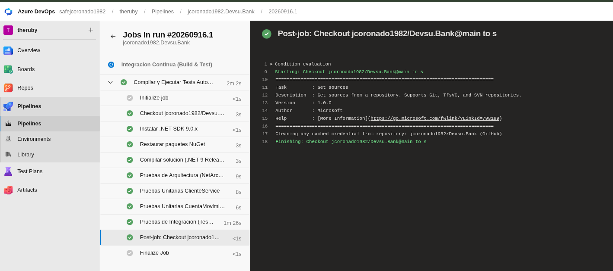

# 🏛️ Devsu Banking Microservices (.NET 9)

Solución de microservicios bancarios desarrollada por **Jesús Alberto Coronado** para la prueba técnica de Devsu, basada en **.NET 9 (C# 13)**, **Clean Architecture**, **PostgreSQL 16** y mensajería asíncrona con **RabbitMQ** (MassTransit).

---

## 🚀 Cómo probar la solución

Se ofrecen dos alternativas para evaluar el proyecto: directamente en la nube (sin instalaciones) o en local mediante Docker.

### Opción 1: Probar en línea (Directo en Internet - Sin instalar nada)

Los microservicios se encuentran desplegados y listos para probar:

- **Swagger Clientes:** [https://clientes.launch.lat/swagger](https://clientes.launch.lat/swagger)
- **API Clientes:** `https://clientes.launch.lat/clientes`
- **Swagger Cuentas y Movimientos:** [https://cuentas.launch.lat/swagger](https://cuentas.launch.lat/swagger)
- **API Cuentas:** `https://cuentas.launch.lat/cuentas`
- **API Movimientos:** `https://cuentas.launch.lat/movimientos`
- **API Reportes:** `https://cuentas.launch.lat/reportes?fecha=2022-01-01,2026-12-31&cliente=Jose Lema`

Para validar con **Postman**, solo se debe importar la colección [`devsu-banking.postman_collection.json`](devsu-banking.postman_collection.json) y apuntar las peticiones a estos dominios públicos.

### Opción 2: Probar en Local con Docker (1 solo comando)

**Único requisito:** Tener [Docker Desktop](https://docs.docker.com/get-docker/) o Docker Engine activo. No requiere .NET, PostgreSQL ni RabbitMQ instalados en la máquina.

1. **Levantar los servicios:**
   - En cualquier sistema operativo (Linux, Mac o Windows), ejecutar en la raíz:
     ```bash
     docker compose up --build -d
     ```
   - O usando los scripts automáticos incluidos:
     - **Windows:** Doble clic en `levantar.bat` (o ejecutar `levantar.ps1`).
     - **Linux / macOS:** Ejecutar `./levantar.sh`.

2. **Acceso local:**
   - **Swagger Clientes:** [http://localhost:8081/swagger](http://localhost:8081/swagger)
   - **Swagger Cuentas y Movimientos:** [http://localhost:8083/swagger](http://localhost:8083/swagger)
   - **.NET Aspire Dashboard (Trazabilidad y Métricas):** [http://localhost:18888](http://localhost:18888)
   - **RabbitMQ Dashboard:** [http://localhost:15672](http://localhost:15672) *(usuario `devsu_admin` / credenciales en `.env`)*
   - **Visores visuales de BD (PGWeb):** [http://localhost:8089](http://localhost:8089) (Clientes) | [http://localhost:8090](http://localhost:8090) (Cuentas)

3. **Detener el ambiente:**
   ```bash
   docker compose down
   ```
   *(o con `detener.bat` en Windows / `./detener.sh` en Linux).*

### 🌐 Tabla Comparativa de Direcciones

| Servicio / Endpoint | En la Nube (Producción) | En Local (Docker) |
| :--- | :--- | :--- |
| **API Clientes** | `https://clientes.launch.lat/clientes` | `http://localhost:8081/clientes` |
| **Swagger Clientes** | [https://clientes.launch.lat/swagger](https://clientes.launch.lat/swagger) | [http://localhost:8081/swagger](http://localhost:8081/swagger) |
| **API Cuentas** | `https://cuentas.launch.lat/cuentas` | `http://localhost:8083/cuentas` |
| **API Movimientos** | `https://cuentas.launch.lat/movimientos` | `http://localhost:8083/movimientos` |
| **API Reportes (Estado de Cuenta)** | `https://cuentas.launch.lat/reportes` | `http://localhost:8083/reportes` |
| **Swagger Cuentas y Reportes** | [https://cuentas.launch.lat/swagger](https://cuentas.launch.lat/swagger) | [http://localhost:8083/swagger](http://localhost:8083/swagger) |
| **.NET Aspire Dashboard (Trazas)** | — | [http://localhost:18888](http://localhost:18888) |
| **RabbitMQ Management** | — | [http://localhost:15672](http://localhost:15672) |
| **Visores de Base de Datos (PGWeb)** | — | [http://localhost:8089](http://localhost:8089) / [:8090](http://localhost:8090) |

---

## 🏛️ Arquitectura del Sistema

La solución implementa una arquitectura desacoplada de 2 microservicios con patrón **Database-per-Service** y comunicación asíncrona por eventos sobre RabbitMQ:


1. **`ClienteService` (Puerto 8081 / `https://clientes.launch.lat`):**
   - Gestión de `Persona` y `Cliente` (herencia Table-per-Type).
   - Hasheo de contraseñas con BCrypt.
   - Publica eventos asíncronos (`ClienteCreadoEvent`, `ClienteActualizadoEvent`, `ClienteEliminadoEvent`).

2. **`CuentaMovimientoService` (Puerto 8083 / `https://cuentas.launch.lat`):**
   - Gestión de `Cuenta` y registro transaccional de `Movimientos`.
   - Control de saldo insuficiente (HTTP 400 con mensaje `"Saldo no disponible"`).
   - Control de cupo diario acumulado de retiros ($1,000.00).
   - Reporte consolidado de estado de cuenta (`/reportes?fecha=...&cliente=...`).
   - Sincroniza datos de clientes consumiendo los eventos de RabbitMQ.

---

## 🧩 Clean Architecture (Estructura Interna)

Cada microservicio implementa **Clean Architecture** estructurado en cuatro capas concéntricas con inversión de dependencias:


- **Domain:** Entidades puras POCO (`Cliente`, `Persona`, `Cuenta`, `Movimiento`), reglas de negocio y puertos (interfaces). Cero dependencias externas.
- **Application:** Casos de uso, orquestación, DTOs y validadores de negocio.
- **Infrastructure:** Adaptadores técnicos (EF Core 9, repositorios PostgreSQL y bus de RabbitMQ).
- **Api:** Controladores REST delgados, serialización JSON y middleware global de excepciones.

---

## 🗄️ Modelo de Base de Datos Relacional

PostgreSQL 16 con dos bases de datos independientes (`devsu_clientes` y `devsu_cuentas`), restricciones de integridad física (`CHECK`) y claves foráneas:


El script DDL consolidado para recrear toda la estructura se encuentra en [`BaseDatos.sql`](BaseDatos.sql).

---

## ⚡ Flujo Transaccional de Movimientos

Ciclo de vida de una transacción financiera (`POST /movimientos`), validando saldo disponible, cupo diario acumulado y concurrencia optimista:


---

## 🔄 Sincronización Asíncrona y Reportes (CQRS)

Sincronización eventual entre servicios mediante eventos de RabbitMQ para alimentar proyecciones locales de lectura rápida en el reporte de estado de cuenta:


---

## 🔭 Observabilidad, Métricas y Trazabilidad (.NET Aspire Dashboard)

El proyecto cuenta con instrumentación **OpenTelemetry** completa integrada nativamente en ambos microservicios (`Devsu.Banking.ServiceDefaults`), exportando métricas, trazas y registros estructurados hacia el **.NET Aspire Dashboard**:

- **Acceso directo:** [http://localhost:18888](http://localhost:18888) *(acceso libre sin contraseña)*.
- **Trazabilidad Distribuida (Traces):** Permite inspeccionar en cascada el flujo completo de una operación a través de los límites del servicio: desde la petición HTTP inicial, la consulta en PostgreSQL (`Npgsql`), la publicación del mensaje en RabbitMQ (`MassTransit`) hasta el consumo y persistencia en el microservicio destino (propagación W3C `traceparent`).
- **Logs Estructurados en Tiempo Real:** Consola unificada de logs semánticos de ambos microservicios para auditoría y diagnóstico de fallos.
- **Métricas del Sistema:** Visualización de peticiones por segundo, latencias p95/p99, hilos activos y consumo de memoria.

### 🛠️ Herramientas de Inspección Adicionales Incluidas:
- **Visor de Base de Datos PGWeb:** [http://localhost:8089](http://localhost:8089) — Cliente web interactivo para examinar tablas, restricciones y ejecutar queries en PostgreSQL sin requerir software adicional (DBeaver o pgAdmin).
- **RabbitMQ Management Dashboard:** [http://localhost:15672](http://localhost:15672) — Monitoreo de colas, exchanges y enrutamiento de eventos con credenciales `guest` / `guest`.
- **Health Checks Cloud-Native:** Endpoints de salud para orquestadores:
  - `ClienteService`: `http://localhost:8081/health` (Readiness) y `/alive` (Liveness).
  - `CuentaMovimientoService`: `http://localhost:8083/health` (Readiness) y `/alive` (Liveness).

---

## 📬 Validación de Endpoints con Postman

Se incluye la colección oficial con los casos de uso automatizados: [`devsu-banking.postman_collection.json`](devsu-banking.postman_collection.json).


### Ejecución por consola (Newman CLI):
```bash
./test-postman-cli.sh
```
*También se puede importar directamente en la aplicación Postman para probar tanto en local como contra los endpoints públicos.*

---

## 🧪 Pruebas Automatizadas (.NET)

La solución cuenta con **58 pruebas automatizadas** que validan la lógica de negocio, reglas de dominio y cumplimiento de Clean Architecture sin dependencias externas, además de pruebas de integración end-to-end.

Se puede ejecutar fácilmente según el entorno que dispongas:

### Opción A: Con 1 solo comando / clic (Con o sin .NET instalado)
Los scripts detectan automáticamente si dispones del SDK de .NET 9 en tu sistema. Si no lo tienes instalado, ejecutan las pruebas limpiamente a través de un contenedor oficial de .NET:
- **Windows:** Doble clic en `probar.bat`
- **Linux / macOS:** Ejecutar `./probar.sh`

### Opción B: Por consola con .NET SDK
Si dispones del SDK de .NET 9 instalado:

```bash
# 1. Pruebas Unitarias y de Arquitectura (58 pruebas requeridas por la prueba técnica):
# Se ejecutan 100% en memoria en ~2 segundos sin requerir bases de datos ni Docker:
dotnet test --filter "FullyQualifiedName!~Integration"

# O ejecutando cada proyecto individualmente:
dotnet test tests/ClienteService.UnitTests
dotnet test tests/CuentaMovimientoService.UnitTests
dotnet test tests/ArchitectureTests

# 2. Suite Completa (incluyendo Integración con Testcontainers contra Postgres efímero):
dotnet test
```

### Cobertura de las Pruebas:
- **`ClienteService.UnitTests` (13 pruebas):** Reglas de dominio de `Cliente` y `Persona`, hasheo de contraseñas con BCrypt y validación de estados.
- **`CuentaMovimientoService.UnitTests` (35 pruebas):** Creación de cuentas, transacciones financieras de depósitos y retiros, validación de saldo insuficiente (`"Saldo no disponible"`), y control de cupo diario acumulado de retiros ($1,000.00).
- **`ArchitectureTests` (10 pruebas):** Verificación automática con `NetArchTest` de las reglas de Clean Architecture (las capas de Dominio y Aplicación no tienen dependencias hacia la Infraestructura o API).
- **`CuentaMovimientoService.IntegrationTests` (10 pruebas):** Flujo bancario transaccional de extremo a extremo contra PostgreSQL y RabbitMQ efímeros vía Testcontainers.

---

## 🔄 Integración Continua y Despliegue (CI/CD)

El proyecto cuenta con un pipeline automatizado en **Azure DevOps** ([`azure-pipelines.yml`](azure-pipelines.yml)) que valida la solución en cada `push` o `Pull Request`:



- **Compilación y Empaquetado:** Validación limpia bajo .NET 9 Release con cero errores.
- **Validación Automatizada:** Ejecución de pruebas unitarias, de arquitectura y de integración con PostgreSQL efímero en Testcontainers.
- **Trazabilidad de Ejecución:** Integración continua directa vinculada al repositorio en GitHub.

---

## 📁 Estructura del Repositorio

- `src/`: Código fuente de `ClienteService` y `CuentaMovimientoService`.
- `tests/`: Suites de pruebas unitarias, de integración y arquitectura.
- `docs/`: Diagramas de arquitectura y capturas del sistema.
- `BaseDatos.sql`: Script DDL físico de PostgreSQL.
- `devsu-banking.postman_collection.json`: Colección de pruebas de Postman.
- `docker-compose.yml`: Orquestador de contenedores.
- `levantar.sh` / `levantar.bat`: Scripts de arranque automático de la solución.
- `probar.sh` / `probar.bat`: Scripts de ejecución automática de las 58 pruebas.

---

## 👤 Autor

- **Jesús Alberto Coronado** - *Ingeniero de Software Senior .NET*
- **Repositorio:** [https://github.com/jcoronado1982/Devsu.Bank](https://github.com/jcoronado1982/Devsu.Bank)

