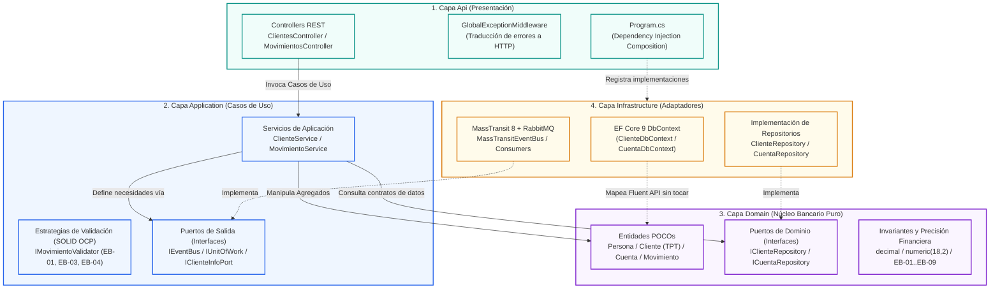

# 🧩 Diagrama de Clean Architecture y Puertos y Adaptadores (Nivel Micro / Capas)

Este documento detalla la estructura interna de código de cada uno de los microservicios (`ClienteService` y `CuentaMovimientoService`). Demuestra cómo se aplican los principios de **Clean Architecture**, **Onion / Hexagonal Architecture**, **SOLID** y la **Regla de Dependencia Inmutable**.

---

## 1. 🖼️ Diagrama de Capas, Puertos y Adaptadores

---

## 2. 📐 Diagrama Conceptual de Dependencias (Mermaid)

---

## 3. 🏛️ Responsabilidades por Capa y Principios SOLID

### 1. `*.Domain` (Núcleo Puro POCO)
* **Aislamiento Total:** Prohibido referenciar librerías externas (ni EF Core, ni ASP.NET, ni MassTransit).
* **Entidades Clave:**
  * `Persona` ➔ Entidad base demográfica.
  * `Cliente : Persona` ➔ Herencia TPT (*Table-Per-Type*).
  * `Cuenta` ➔ Invariante de saldo actual derivado del balance transaccional: `ObtenerSaldoActual() = SaldoInicial + Sum(movimientos)`.
  * `Movimiento` ➔ Registro inmutable del libro mayor (*Ledger*).
* **Puertos de Dominio:** `IClienteRepository`, `ICuentaRepository`, `IMovimientoRepository` (Principio de Segregación de Interfaces - ISP).

### 2. `*.Application` (Casos de Uso y Orquestación)
* **Responsabilidad Única (SRP):** Orquesta el flujo entre repositorios, validadores y el bus de eventos.
* **Principio Abierto / Cerrado (OCP):** Los casos borde financieros se validan polimórficamente con `IMovimientoValidator`:
  * `SaldoSuficienteValidator` (EB-01)
  * `CupoDiarioValidator` (EB-03)
  * `CuentaActivaValidator` (EB-04)
* **Puertos de Aplicación:** `IEventBus`, `IUnitOfWork`, `IClienteInfoPort`.

### 3. `*.Infrastructure` (Adaptadores Técnicos de Entrada y Salida)
* **Principio de Inversión de Dependencias (DIP):** Los detalles de bajo nivel (EF Core, PostgreSQL, RabbitMQ) dependen de las abstracciones de alto nivel definidas en `Domain` y `Application`.
* **Persistencia Relacional:** Fluent API en `IEntityTypeConfiguration<T>` mantiene las entidades de dominio 100% limpias de atributos como `[Table]`, `[Column]` o `[Key]`.
* **MassTransit:** Adaptadores técnicos (`ClienteCreadoMassTransitConsumer`) transforman mensajes AMQP a handlers agnósticos (`IIntegrationEventHandler<T>`).

### 4. `*.Api` (Presentación e Ingress)
* **Controladores Delgados:** Únicamente reciben solicitudes HTTP, delegan a los servicios de aplicación y retornan códigos de estado estándar (`200 OK`, `201 Created`).
* **Manejo Centralizado de Excepciones:** `GlobalExceptionMiddleware` intercepta excepciones de negocio y las traduce de forma transparente a respuestas HTTP RFC 7807 sin ensuciar los controladores con bloques `try/catch`.
