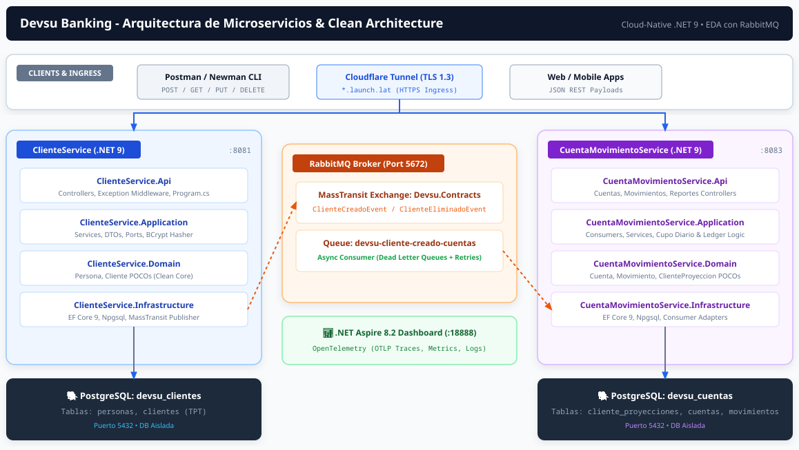
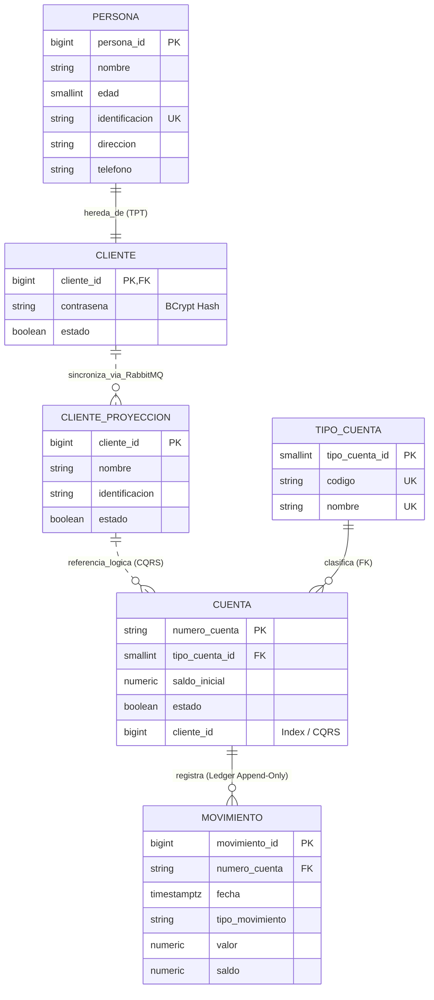

# 📊 Diagramas de Arquitectura y Entidad - Relación (Devsu Banking)

Este documento describe el diseño físico de bases de datos por microservicio (**Database-per-Service**) y la arquitectura general del sistema bancario desarrollado en **.NET 9 (C# 13)** con comunicación asíncrona mediante **RabbitMQ (MassTransit)**.

---

## 1. 🗄️ Diagrama Físico de Base de Datos (Database-per-Service)

El sistema utiliza dos bases de datos completamente independientes y aisladas en PostgreSQL 16 para garantizar el desacoplamiento total de los microservicios:

### Estructura de las Bases de Datos:

#### A. Base de Datos `devsu_clientes` (Microservicio: `ClienteService`)
* **`personas`**: Contiene la información demográfica común.
  * `persona_id` (PK, bigint)
  * `nombre` (varchar 100, NOT NULL, CHECK length >= 2)
  * `genero` (varchar 20, NOT NULL)
  * `edad` (smallint, NOT NULL, CHECK (edad >= 0 AND edad <= 120))
  * `identificacion` (varchar 20, UNIQUE, NOT NULL, CHECK length >= 3)
  * `direccion` (varchar 255, NOT NULL)
  * `telefono` (varchar 20, NOT NULL)
* **`clientes`**: Especialización de `personas` bajo estrategia **Table-Per-Type (TPT)**.
  * `cliente_id` (PK / FK hacia `personas.persona_id`)
  * `contrasena` (varchar 255, hash BCrypt con WorkFactor 12, CHECK length >= 4)
  * `estado` (boolean, DEFAULT true)

#### B. Base de Datos `devsu_cuentas` (Microservicio: `CuentaMovimientoService`)
* **`cliente_proyecciones`**: Proyección local de solo lectura sincronizada asíncronamente vía eventos RabbitMQ (patrón *Event-Carried State Transfer* / CQRS).
  * `cliente_id` (PK, bigint)
  * `nombre` (varchar 100, NOT NULL)
  * `identificacion` (varchar 20, NOT NULL)
  * `estado` (boolean, DEFAULT true)
* **`tipos_cuenta`**: Tabla de catálogo para clasificar el tipo de cuenta bancaria.
  * `tipo_cuenta_id` (PK, smallint)
  * `codigo` (varchar 10, UNIQUE - 'AHORRO', 'CORRIENTE')
  * `nombre` (varchar 20, UNIQUE - 'Ahorros', 'Corriente')
* **`cuentas`**: Cuentas bancarias de los clientes.
  * `numero_cuenta` (PK, varchar 34 - Estándar ISO 13616 / IBAN / CBU)
  * `tipo_cuenta_id` (FK hacia `tipos_cuenta.tipo_cuenta_id`, smallint)
  * `saldo_inicial` (numeric 18,2, CHECK >= 0)
  * `estado` (boolean, DEFAULT true)
  * `cliente_id` (bigint, INDEX `IX_cuentas_cliente_id` - validación lógica/CQRS vía `IClienteExistsPort`)
  * `xmin` (xid / RowVersion - token de concurrencia optimista nativo de PostgreSQL para prevenir sobregiros en condiciones de carrera)

> [!NOTE]
> **Sobre el Saldo Actual y el Desacoplamiento Referencial:**
> 1. **Cero almacenamiento de `saldo_actual` en base de datos:** Para cumplir con el principio bancario de *Ledger Append-Only* y evitar desincronizaciones entre una columna cacheada y los movimientos reales, el saldo actual no es una columna física en PostgreSQL; se calcula dinámicamente en tiempo de ejecución (`SaldoInicial + Sum(movimientos.valor)`).
> 2. **Cero Foreign Key física con `cliente_proyecciones`:** En PostgreSQL no existe un constraint FK físico entre `cuentas` y `cliente_proyecciones`. La verificación de existencia y estado del cliente se gestiona a nivel de aplicación mediante el puerto `IClienteExistsPort`, facilitando el desacoplamiento y el manejo de sincronizaciones eventuales.

* **`movimientos`**: Libro mayor (*Ledger*) transaccional inmutable.
  * `movimiento_id` (PK, bigint)
  * `numero_cuenta` (FK hacia `cuentas.numero_cuenta`, varchar 34, ON DELETE RESTRICT)
  * `fecha` (timestamptz)
  * `tipo_movimiento` (varchar 50 - 'Deposito' o 'Retiro', CHECK tipo_movimiento IN ('Deposito', 'Retiro', 'Depósito'))
  * `valor` (numeric 18,2, CHECK valor <> 0)
  * `saldo` (numeric 18,2, CHECK saldo >= 0)
  * **Trigger de Base de Datos:** `trg_validar_saldo_ledger` (disparador `BEFORE INSERT` que calcula secuencialmente el saldo final y activa la restricción `CK_movimientos_saldo` si ocurre un sobregiro).

---

## 2. 🏛️ Diagrama de Arquitectura de Microservicios

### Componentes Principales:
1. **Puntos de Entrada e Ingress:**
   * **Postman / Newman CLI:** Ejecución automatizada de pruebas de contrato y validación de APIs.
   * **Cloudflare Tunnel (TLS 1.3):** Enrutamiento seguro HTTPS público hacia `*.launch.lat` (`clientes.launch.lat`, `cuentas.launch.lat`).
2. **Microservicios .NET 9 (Clean Architecture / Puertos y Adaptadores):**
   * **`ClienteService`** (Puerto local :8081)
   * **`CuentaMovimientoService`** (Puerto local :8083)
3. **Broker de Mensajería:**
   * **RabbitMQ 3 con MassTransit:** Publica `ClienteCreadoEvent` y `ClienteEliminadoEvent` para mantener la sincronización eventual sin acoplamiento HTTP entre servicios.
4. **Observabilidad y Telemetría:**
   * **.NET Aspire 8.2 Dashboard:** Recolección de trazas distribuidas W3C, métricas y logs estructurados vía protocolo OTLP / OpenTelemetry.

---

## 3. 📐 Modelo Conceptual Mermaid

---

## 4. 🔗 Diagramas Relacionados

* [⚡ **Diagrama de Secuencia Transaccional (F2 / F3 - Ledger Append-Only):**](diagrama-secuencia-transaccional.md) Detalla paso a paso el registro de movimientos, cálculo de saldo en tiempo de ejecución, validadores SOLID y manejo de concurrencia con `xmin`.
* [🔄 **Diagrama del Reporte CQRS y Sincronización Asíncrona (F4):**](diagrama-reporte-cqrs.md) Flujo de sincronización vía RabbitMQ y generación de reportes de estado de cuenta cruzados con latencia sub-milisegundo.
* [🧩 **Diagrama de Clean Architecture y Puertos y Adaptadores:**](diagrama-clean-architecture.md) Estructura interna de los microservicios, aislamiento del Dominio y Principio de Inversión de Dependencias (DIP).

