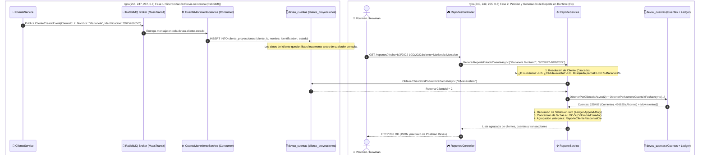

# 🔄 Diagrama del Reporte CQRS y Sincronización Asíncrona (F4)

Este documento detalla la arquitectura de generación de reportes de estado de cuenta (`GET /reportes?fecha=...&cliente=...`) en el microservicio `CuentaMovimientoService`. Explica cómo se resuelve una consulta cruzada de dos dominios de negocio distintos (`Clientes` y `Cuentas/Movimientos`) **sin compartir base de datos y sin llamadas HTTP síncronas bloqueantes**.

---

## 1. 🖼️ Diagrama de Arquitectura y Flujo CQRS

---

## 2. 📐 Diagrama Interactivo de Flujo (Mermaid)

---

## 3. 🎯 Argumentos Clave para la Entrevista Técnica

### ¿Cómo responder a la pregunta clásica del entrevistador?:
> *"Si separaste las bases de datos de Clientes y Cuentas por Database-per-Service, ¿cómo armas el reporte de estado de cuenta que requiere el nombre del cliente junto a sus cuentas y movimientos sin hacer un JOIN entre bases de datos?"*

1. **Patrón Event-Carried State Transfer (CQRS Read Model):**  
   `CuentaMovimientoService` no necesita preguntarle a `ClienteService` quién es el cliente en el momento del reporte. Mantiene su propia tabla de proyección local optimizada para lectura (`cliente_proyecciones`), alimentada asíncronamente por eventos `ClienteCreadoEvent` vía RabbitMQ.
2. **Resiliencia Extrema (Cero Falla en Cascada):**  
   Si `ClienteService` llega a caerse, apagarse o saturarse, la generación de reportes y la operativa bancaria de cuentas **sigue funcionando al 100%** de forma autónoma.
3. **Latencia Sub-milisegundo:**  
   Al ser una consulta 100% local en PostgreSQL `devsu_cuentas`, la respuesta tarda entre **2 y 4 ms**, en lugar de incurrir en penalizaciones de 50-100 ms por llamadas HTTP REST síncronas entre microservicios.
4. **Búsqueda Inteligente en Cascada (UX Real):**  
   El parámetro `cliente` acepta indistintamente:
   - ID numérico del cliente (`cliente=2`)
   - Identificación / Cédula (`cliente=0975489650`)
   - Nombre parcial insensible a mayúsculas (`cliente=marianela`)
5. **Regla EB-09:**  
   Si el cliente existe pero no registró movimientos en el rango de fechas, el servicio retorna una lista vacía `[]` con HTTP 200 OK en lugar de fallar con 404 o 500.
