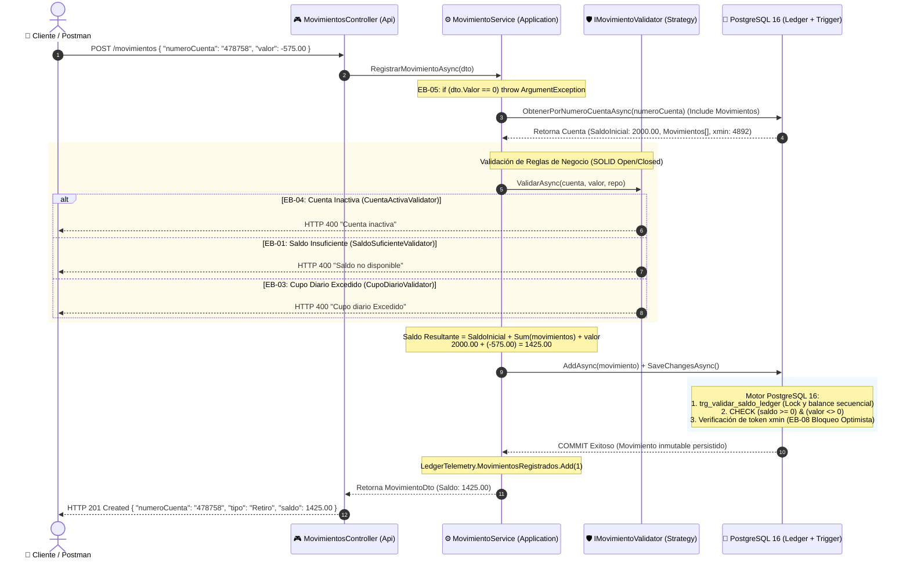

# ⚡ Diagrama de Secuencia Transaccional - Ledger Bancario (F2 / F3)

Este documento detalla el ciclo de vida de una transacción financiera al registrar un movimiento (`POST /movimientos`) en el microservicio `CuentaMovimientoService`. Describe cómo se garantiza la **inmutabilidad contable (Ledger Append-Only)**, el **cálculo de saldo en tiempo de ejecución**, el **bloqueo optimista contra sobregiros (EB-08)** y la evaluación de reglas mediante el patrón **Strategy (SOLID)**.

---

## 1. 🖼️ Diagrama de Secuencia Visual

---

## 2. 📐 Diagrama Interactivo (Mermaid)

---

## 3. 🛡️ Cobertura de Casos Borde y Defensa Técnica para la Entrevista

| Caso Borde | Descripción | Componente que lo valida | Respuesta HTTP |
| :--- | :--- | :--- | :--- |
| **EB-05** | Movimiento con valor `$0.00` | `MovimientoService.cs` *(Guard clause)* | **HTTP 400** `"El valor del movimiento no puede ser cero."` |
| **EB-04** | Operación en cuenta inactiva (`estado = false`) | `CuentaActivaValidator.cs` *(Strategy)* | **HTTP 400** `"Cuenta inactiva"` |
| **EB-01** | Retiro superior al saldo disponible | `SaldoSuficienteValidator.cs` *(Strategy)* | **HTTP 400** `"Saldo no disponible"` |
| **EB-02** | Retiro exactamente igual al saldo | Flujo exitoso estándar | **HTTP 201** Saldo resultante `$0.00` |
| **EB-03** | Retiros acumulados en el día > $1,000.00 | `CupoDiarioValidator.cs` *(Strategy)* | **HTTP 400** `"Cupo diario Excedido"` |
| **EB-08** | Condiciones de carrera / Concurrencia simultánea | PostgreSQL + EF Core `xmin (xid / RowVersion)` | Bloqueo optimista nativo evita sobregiros concurrentes |

---

## 4. 💡 Principios Clave Demostrados

1. **Clean Architecture (Separación de Intereses):**  
   El controlador (`MovimientosController`) es extremadamente delgado: solo recibe la solicitud HTTP y devuelve `201 Created`. Toda la orquestación reside en `Application` y las entidades en `Domain`.
2. **SOLID (Principio Abierto / Cerrado - OCP):**  
   Cada regla financiera (`EB-01`, `EB-03`, `EB-04`) es una clase independiente que implementa `IMovimientoValidator`. Si el banco agrega una nueva regla de límite (por ejemplo, límite nocturno), solo se agrega una nueva clase validadora sin modificar `MovimientoService`.
3. **Ledger Append-Only (Cero Overposting):**  
   No existe una columna `saldo_actual` en la tabla `cuentas`. El saldo se deduce en memoria sumando el balance inicial y los movimientos inmutables. PostgreSQL ratifica la integridad final mediante el disparador `trg_validar_saldo_ledger`.
